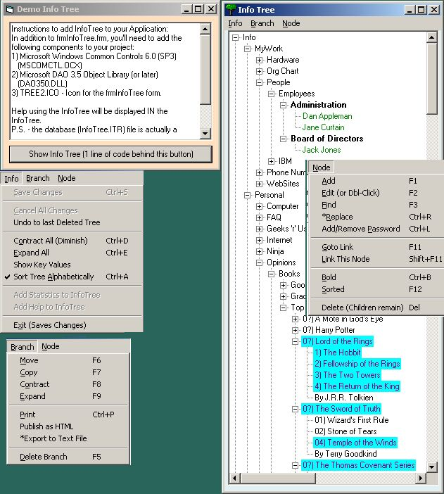



## InfoTree \- Personal Information Organizer

### Description

The InfoTree lets you store and retrieve text data, and organize it as you wish. Features (many are color-coded) include:

- Moving, copying, deleting (with or without all sub-branches) and sorting branches.

- Exporting to Text File, Publishing as HTML List.

- Add, Edit, Delete, Find, and Bold Text data.

- Cross-linked (aliased) branches or nodes.

- Password protected Nodes (hint: Use this on the parent of the node to be protected).

- Automatic In-tree help and tree statistics.

This project was developed in an effort to understand LDAP tree structures. This app is NOT LDAP compliant, but uses similar philosophies to attain high-speed data storage and retrieval.
 
### More Info
 
Keyboard Input

you'll need to add the following components to use InfoTree in your project (already referenced in this demo project):

1) Microsoft Windows Common Controls 6.0 (SP3)

(MSCOMCTL.OCX)

2) Microsoft DAO 3.5 Object Library (or later)

(DAO350.DLL)

The *Replace menu function has not yet been coded. After making this a 'stand-alone' application (it has been in use for nearly a year as part of a larger App), I noticed during testing that the print key actually sends the data you requested to InfoTree.txt on your desktop, then opens NotePad to view/print it.

Output to Screen, Text File, or HTML file.

             |
---                |---
**Submitted On**   |2003-06-25 09:48:18
**By**             |[Richard Kipp](https://github.com/Planet-Source-Code/PSCIndex/blob/master/ByAuthor/richard-kipp.md)
**Level**          |Advanced
**User Rating**    |4.9 (39 globes from 8 users)
**Compatibility**  |VB 6\.0
**Category**       |[Complete Applications](https://github.com/Planet-Source-Code/PSCIndex/blob/master/ByCategory/complete-applications__1-27.md)
**World**          |[Visual Basic](https://github.com/Planet-Source-Code/PSCIndex/blob/master/ByWorld/visual-basic.md)
**Archive File**   |[InfoTree\_\-1605666252003\.zip](https://github.com/Planet-Source-Code/richard-kipp-infotree-personal-information-organizer__1-46432/archive/master.zip)

